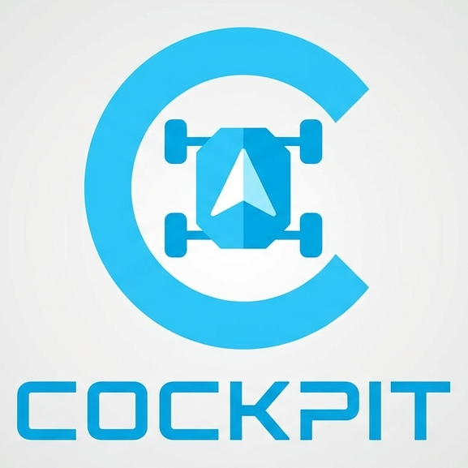

# Cockpit Modular Desktop

Aplicación desktop modular para tooling de robótica, construida con **React + TypeScript + Tauri**.

## Stack

- Frontend: React + TSX (Vite)
- Runtime desktop: Tauri 2
- Comunicación backend: WebSocket / HTTP
- Arquitectura: `Frontend -> Services -> Dispatchers -> Transports`

## Requisitos

- Node.js 18+
- npm 9+
- Rust toolchain
- Dependencias de sistema para Tauri (según tu SO)

## Variables de entorno

Copiar y ajustar:

```bash
cp .env.example .env
```

## Comandos

```bash
npm install
npm run dev         # Frontend Vite
npm run tauri:dev   # App desktop en desarrollo
npm run build       # Build web
npm run tauri:build # Build desktop
npm run test        # Tests
```
